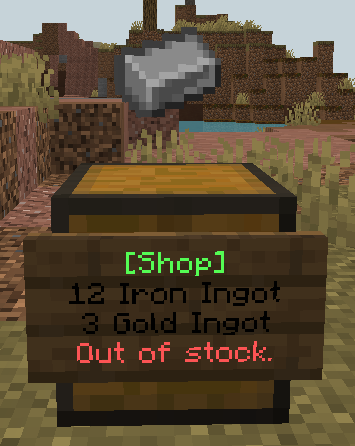
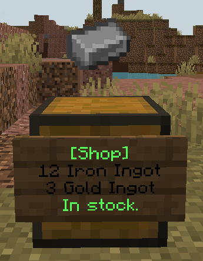
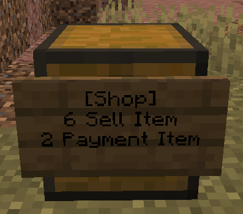
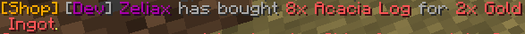

# shopper
Chest shop plugin for minecraft.

## Features
- Sell items for items

## Todo
- Add a way to manage all your shops via a menu
- Add a way to grant players access to manage your shop
- Add support for double chests (detects as shop chest & item hologram is placed in the middle)
- Add checks for if someone uses a hopper & such

## Screenshots
Out of stock shop

---
In stock shop

---
Example setup

---
Purchase message

